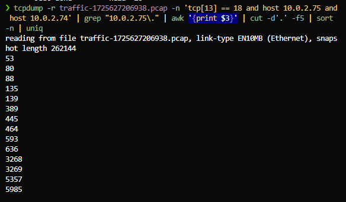
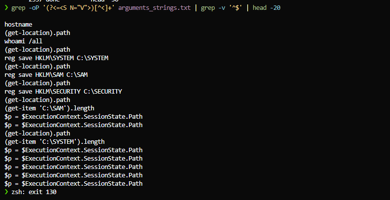
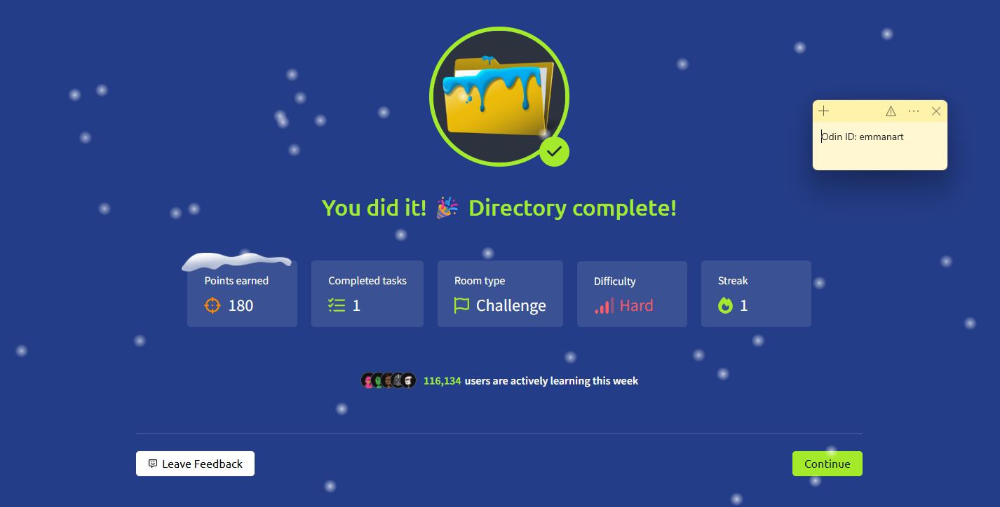

# Directory Challenge - Solution Steps

This document outlines the **correct solution path** for each question in the Directory TryHackMe challenge, extracted from all the attempts documented in `completion_attempts.md`.

## Main Computer Security Concepts Covered

This challenge demonstrates the following key computer security concepts:

### Security Properties (CIA Triad)

- **Confidentiality (Compromised):** The challenge shows how encrypted network traffic (WinRM) can be decrypted, how password hashes can be extracted from authentication protocols, and how sensitive data (usernames, credentials, executed commands) can be revealed through network analysis. This demonstrates **disclosure** - the compromise of confidentiality.

- **Integrity (Compromised):** The attacker executes commands on the compromised system (registry exports), demonstrating how unauthorized access can lead to system modification. This shows **alteration** - the compromise of integrity.

- **Availability:** Not directly demonstrated in this challenge (no denial-of-service or system disruption).

- **Reliability:** Not directly demonstrated (this property relates to system functioning over time under varying circumstances).

### Security Mechanisms & Techniques

- **Network Traffic Analysis:** Analyzing packet capture files (PCAP) to understand network communication patterns and identify security events.
- **Port Scanning & Reconnaissance:** Identifying open ports and services on target systems through TCP flag analysis (SYN-ACK responses).
- **Authentication Protocols:** Understanding how Kerberos and NTLM authentication work, where usernames and credentials appear in network traffic, and how to extract them. Demonstrates authentication bypass through credential theft.
- **Password Security & Hash Cracking:** Demonstrating why weak passwords are vulnerable to dictionary attacks using tools like Hashcat with wordlists.
- **Encryption & Decryption:** Decrypting encrypted network traffic (WinRM) using derived session keys to reveal hidden command execution.
- **Protocol Analysis:** Deep packet inspection using tools like `tcpdump` and `tshark` to extract protocol-specific fields and understand protocol behavior.
- **Digital Forensics:** Following the attack chain from initial reconnaissance through authentication to command execution, and extracting forensic artifacts from network traffic.
- **Post-Exploitation Techniques:** Identifying attacker actions after gaining access, such as registry hive extraction for password hash harvesting.
- **Access Control (Authorization):** The challenge demonstrates how an attacker bypassed authorization controls by stealing credentials and gaining unauthorized access to the system.

---

## Question 1: Open Ports

**Question:** "What ports did the threat actor initially find open? (Format: from lowest to highest, separated by comma)"

### Correct Solution Path

**Step 1: Find SYN-ACK responses (open ports)**
The attacker performed a port scan. Open ports respond with SYN-ACK (TCP flags SYN and ACK set), while closed ports respond with RST.

```sh
❯ tcpdump -r traffic-1725627206938.pcap -n 'tcp[13] == 18' | grep "10.0.2.75\." | head -20
reading from file traffic-1725627206938.pcap, link-type EN10MB (Ethernet), snapshot length 262144
20:41:44.673073 IP 10.0.2.75.445 > 10.0.2.74.47879: Flags [S.], seq 4192866086, ack 2808151402, win 64240, options [mss 1460], length 0
20:41:44.673392 IP 10.0.2.75.80 > 10.0.2.74.47879: Flags [S.], seq 1149992143, ack 2808151402, win 64240, options [mss 1460], length 0
20:41:44.673668 IP 10.0.2.75.139 > 10.0.2.74.47879: Flags [S.], seq 2217381648, ack 2808151402, win 8192, options [mss 1460], length 0
20:41:44.673695 IP 10.0.2.75.53 > 10.0.2.74.47879: Flags [S.], seq 4098698924, ack 2808151402, win 64240, options [mss 1460], length 0
20:41:44.673722 IP 10.0.2.75.135 > 10.0.2.74.47879: Flags [S.], seq 163846839, ack 2808151402, win 64240, options [mss 1460], length 0
20:41:44.675820 IP 10.0.2.75.464 > 10.0.2.74.47879: Flags [S.], seq 1211919844, ack 2808151402, win 64240, options [mss 1460], length 0
20:41:44.700313 IP 10.0.2.75.3269 > 10.0.2.74.47879: Flags [S.], seq 4098698924, ack 2808151402, win 64240, options [mss 1460], length 0
20:41:44.700454 IP 10.0.2.75.88 > 10.0.2.74.47879: Flags [S.], seq 2740409073, ack 2808151402, win 64240, options [mss 1460], length 0
20:41:44.703692 IP 10.0.2.75.593 > 10.0.2.74.47879: Flags [S.], seq 2321940376, ack 2808151402, win 64240, options [mss 1460], length 0
20:41:44.707099 IP 10.0.2.75.3268 > 10.0.2.74.47879: Flags [S.], seq 1583480422, ack 2808151402, win 64240, options [mss 1460], length 0
20:41:44.710302 IP 10.0.2.75.389 > 10.0.2.74.47879: Flags [S.], seq 118203166, ack 2808151402, win 64240, options [mss 1460], length 0
20:41:44.726408 IP 10.0.2.75.5357 > 10.0.2.74.47879: Flags [S.], seq 2947709126, ack 2808151402, win 64240, options [mss 1460], length 0
20:41:44.745791 IP 10.0.2.75.636 > 10.0.2.74.47879: Flags [S.], seq 3868501351, ack 2808151402, win 64240, options [mss 1460], length 0
```

**Step 2: Extract and sort port numbers**
Extract the port numbers from SYN-ACK responses, filter to only the initial scan (between attacker and target), and sort numerically.

```sh
❯ tcpdump -r traffic-1725627206938.pcap -n 'tcp[13] == 18 and host 10.0.2.75 and host 10.0.2.74' | grep "10.0.2.75\." | awk '{print $3}' | cut -d'.' -f5 | sort -n | uniq
reading from file traffic-1725627206938.pcap, link-type EN10MB (Ethernet), snapshot length 262144
53
80
88
135
139
389
445
464
593
636
3268
3269
5357
5985
```

**Answer:** `53,80,88,135,139,389,445,464,593,636,3268,3269,5357,5985`



**Why this works:** The filter `tcp[13] == 18` matches packets with both SYN (2) and ACK (16) flags set, which indicates an open port responding to the scan. We then extract the destination port from the target's response and sort them.

**Challenges & Connections:**
- **Challenge:** Initial search included external IPs (outbound connections), requiring host filtering (`host 10.0.2.75 and host 10.0.2.74`)
- **Course Connections:** HW4 (BPF filters, `tcpdump`), HW2 (text processing pipeline), Handout 05c (TCP three-way handshake)

---

## Question 2: Username That Achieved Foothold

**Question:** "The threat actor found four valid usernames, but only one username allowed the attacker to achieve a foothold on the server. What was the username? Format: Domain.TLD\username"

### Correct Solution Path

**Step 1: Examine Kerberos traffic (port 88)**
Kerberos authentication packets contain readable usernames in the ticket requests/responses. This is the legitimate way to extract usernames from encrypted authentication.

```sh
❯ tcpdump -r traffic-1725627206938.pcap -n -A -s 0 'port 88 and tcp[tcpflags] & tcp-push != 0' | head -50
reading from file traffic-1725627206938.pcap, link-type EN10MB (Ethernet), snapshot length 262144
20:43:52.486312 IP 10.0.2.74.47856 > 10.0.2.75.88: Flags [P.], seq 3194854315:3194854470, ack 4038072456, win 502, options [nop,nop,TS val 3916674590 ecr 744687], length 155
...
..0..        larry.doe....DIRECTORY.THM."0 .......0...krbtgt..DIRECTORY.THM....20240127044352Z....
20:43:52.491514 IP 10.0.2.75.88 > 10.0.2.74.47856: Flags [P.], seq 1:1641, ack 155, win 8195, options [nop,nop,TS val 744693 ecr 3916674590], length 1640
...
DIRECTORY.THMlarry.doe....DIRECTORY.THM..0........0.. larry.doe....
```

**Step 2: Find all four usernames**
Extract all usernames from Kerberos traffic to identify the four valid ones.

```sh
❯ tcpdump -r traffic-1725627206938.pcap -n -A -s 0 'port 88 and tcp[tcpflags] & tcp-push != 0' | grep -iE "(\.doe|\.ray|\.kays|\.ranith)" | head -20
reading from file traffic-1725627206938.pcap, link-type EN10MB (Ethernet), snapshot length 262144
..0..        larry.doe....DIRECTORY.THM."0 .......0...krbtgt..DIRECTORY.THM....20240127044352Z....
..DIRECTORY.THMlarry.doe....DIRECTORY.THM..0........0.. larry.doe....
..john.doe....DIRECTORY.THM."0 .......0...krbtgt..DIRECTORY.THM....20240127044432Z....
..ranith.kays....DIRECTORY.THM."0 .......0...krbtgt..DIRECTORY.THM....20240127044432Z....
..joan.ray....DIRECTORY.THM."0 .......0...krbtgt..DIRECTORY.THM....20240127044432Z....
..larry.doe....DIRECTORY.THM."0 .......0...krbtgt..DIRECTORY.THM....20240127044432Z....
..DIRECTORY.THMlarry.doe....DIRECTORY.THM..0........0.. larry.doe....
```

**Step 3: Verify larry.doe in WinRM authentication**
Decode the WinRM Authorization header to confirm larry.doe was used for successful authentication.

```sh
❯ python3 -c "import base64; data = base64.b64decode('TlRMTVNTUAADAAAAGAAYAFgAAAAAAQABcAAAABoAGgBwAQAAEgASAIoBAAAIAAgAnAEAABAAEACkAQAANYKJ4gAIAAAAAAAP3ZiJq22PF9fl9MoInzRbeAAAAAAAAAAAAAAAAAAAAAAAAAAAAAAAAOGOyl1e2KeghoKjzU6ZOz4BAQAAAAAAAIISy3USUNoB/BAQAotscjkAAAAAAgASAEQASQBSAEUAQwBUAE8AUgBZAAEAEABBAEQAUwBFAFIAVgBFAFIABAAaAGQAaQByAGUAYwB0AG8AcgB5AC4AdABoAG0AAwAsAEEARABTAGUAcgB2AGUAcgAuAGQAaQByAGUAYwB0AG8AcgB5AC4AdABoAG0ABQAaAGQAaQByAGUAYwB0AG8AcgB5AC4AdABoAG0ABwAIAIISy3USUNoBCQAeAFcAUwBNAEEATgAvADEAMAAuADAALgAyAC4ANwA1AAYABAACAAAAAAAAAAAAAABkAGkAcgBlAGMAdABvAHIAeQAuAHQAaABtAGwAYQByAHIAeQAuAGQAbwBlAEsAQQBMAEkA7OxhFxbd8xmd/r0XFho3/A=='); print(data.decode('utf-16-le', errors='ignore'))"
呎䵌卓PXĀĀpƜƤ舵...DIRECTORYADSERVERdirectory.thm,ADServer.directory.thmdirectory.th...WSMAN/10.0.2.75directory.thmlarry.doeKALI...
```

**Answer:** `DIRECTORY.THM\larry.doe`

**Why this works:** 
- `larry.doe` appears first in Kerberos traffic (20:43:52), before other usernames
- It appears multiple times, indicating successful authentication
- It's found in the decoded WinRM Authorization header, confirming it was used for remote access
- The timing sequence shows: larry.doe Kerberos → SMB authentication → WinRM connection

**Challenges & Connections:**
- **Challenges:** 
  - Shell escaping issues with backslashes (`grep: Trailing backslash`)
  - NTLM encodes usernames (not readable); had to switch to Kerberos (port 88) where usernames are readable
  - Initially found `john.doe` (wrong) - frequency doesn't indicate correctness; timing matters more
- **Course Connections:** HW4 (`tcpdump` protocol filtering), HW2 (`grep` pattern matching), Handout 04a (Kerberos authentication), Handout 03b (network authentication protocols)

---

## Question 3: Last 30 Characters of Hash

**Question:** "The threat actor captured a hash from the user in question 2. What are the last 30 characters of that hash?"

### Correct Solution Path

**Step 1: Extract hash from Kerberos AS-REP cipher field**
The hash is in the Kerberos AS-REP response cipher field for larry.doe. Use tshark to extract it.

```sh
❯ tshark -r traffic-1725627206938.pcap -Y 'kerberos and kerberos.CNameString == "larry.doe"' -T fields -e kerberos.cipher | tail -n 1 | awk '{print substr($0, length($0)-29)}'
55616532b664cd0b50cda8d4ba469f
```

**Answer:** `55616532b664cd0b50cda8d4ba469f`

**Why this works:**
- The hash is in the Kerberos AS-REP response (frame 4817) for larry.doe
- `tail -n 1` gets the last Kerberos packet (most recent authentication)
- `awk '{print substr($0, length($0)-29)}'` extracts the last 30 characters from the cipher field
- This is the encrypted part of the Kerberos ticket that contains the hash

**Challenges & Connections:**
- **Challenges:**
  - Initially tried NTLM packets (wrong location) - hash is in Kerberos AS-REP, not NTLM
  - Extracted from wrong packet (frame 4779) - needed the last packet (frame 4817) with `tail -n 1`
  - Multiple incorrect hashes before finding correct extraction method
- **Course Connections:** HW4 (`tshark` protocol field extraction), HW2 (`awk` string manipulation), Handout 03a (hash functions), Handout 03b (Kerberos encryption)

---

## Question 4: User's Password

**Question:** "What is the user's password?"

### Correct Solution Path

**Step 1: Extract full Kerberos AS-REP hash in Hashcat format**
Extract the complete hash from frame 4817 and format it for Hashcat (mode 18200).

```sh
❯ tshark -r traffic-1725627206938.pcap -Y "frame.number==4817" -T fields -e kerberos.cipher -e kerberos.CNameString -e kerberos.crealm | awk -F'\t' '{split($1,a,","); print "$krb5asrep$23$"$2"@"$3":"a[2]}' | awk -F':' '{prefix_len=length($1) + 33; print substr($0, 1, prefix_len) "$" substr($0, prefix_len+1)}' > larry_doe_hash.txt
```

**Step 2: Crack the hash with Hashcat**
Use Hashcat mode 18200 (Kerberos 5 AS-REP etype 23) with the rockyou wordlist.

```sh
❯ hashcat -a 0 -m 18200 larry_doe_hash.txt /usr/share/wordlists/rockyou.txt
hashcat (v6.2.6) starting
...
Status...........: Cracked
Hash.Target......: $krb5asrep$23$larry.doe@DIRECTORY.THM:f8716efbaa984...ba469f
Time.Started.....: Fri Dec 12 09:47:17 2025 (0 secs)
Time.Estimated...: Fri Dec 12 09:47:17 2025 (0 secs)
...
Recovered........: 1/1 (100.00%) Digests (total), 1/1 (100.00%) Digests (new)
Progress.........: 184320/14344385 (1.28%)
...
Password1!
```

**Answer:** `Password1!`

**Why this works:**
- Frame 4817 contains the last Kerberos AS-REP response for larry.doe
- The cipher field contains a comma-separated value; we extract the second part for the hash
- Hashcat mode 18200 is specifically for Kerberos 5 AS-REP hashes (etype 23)
- The password was found quickly (at position 184,320 in the rockyou wordlist)

**Challenges & Connections:**
- **Challenges:**
  - Hashcat format error: `Separator unmatched` - Kerberos cipher has comma-separated values; needed complex `awk` to format correctly with `$` separators
  - Tried searching for plaintext password (doesn't exist in properly configured systems)
  - Hash format must match Hashcat's strict requirements for mode 18200
- **Course Connections:** HW3 (Hashcat, dictionary attacks), Handout 04a (password security, dictionary attacks), Handout 03a (hash functions)

---

## Question 5: Second and Third Commands

**Question:** "What were the second and third commands that the threat actor executed on the system? Format: command1,command2"

### Correct Solution Path

**Step 1: Decrypt WinRM traffic**
WinRM traffic is encrypted, so we need to decrypt it using the password we found. Use the provided Python script.

> **Note:** The `decrypt.py` script was obtained from [jborean93's WinRM decrypt gist](https://gist.github.com/jborean93/d6ff5e87f8a9f5cb215cd49826523045). This script decrypts WinRM exchanges authenticated with NTLM over HTTP.

```sh
❯ python3 decrypt.py -p 'Password1!' ./traffic-1725627206938.pcap > decrypted_traffic.txt
```

**Step 2: Extract and decode base64-encoded arguments**
The decrypted XML contains `<rsp:Arguments>` tags with base64-encoded command data.

```sh
❯ grep -oP '(?<=<rsp:Arguments>).*?(?=</rsp:Arguments>)' decrypted_traffic.txt | while read line; do
  echo "$line" | base64 --decode >> arguments.txt
  echo "" >> arguments.txt
done
```

**Step 3: Extract readable strings from binary data**
The decoded data is binary XML, so use `strings` to extract readable text.

```sh
❯ strings arguments.txt > arguments_strings.txt
```

**Step 4: Extract commands from XML structure**
Commands are in `<S N="V">` tags in the XML.

```sh
❯ grep -oP '(?<=<S N="V">)[^<]+' arguments_strings.txt | grep -v '^$' | head -20
hostname
(get-location).path
whoami /all
(get-location).path
reg save HKLM\SYSTEM C:\SYSTEM
(get-location).path
reg save HKLM\SAM C:\SAM
(get-location).path
reg save HKLM\SECURITY C:\SECURITY
(get-location).path
(get-item 'C:\SAM').length
$p = $ExecutionContext.SessionState.Path
$p = $ExecutionContext.SessionState.Path
(get-location).path
(get-item 'C:\SYSTEM').length
$p = $ExecutionContext.SessionState.Path
$p = $ExecutionContext.SessionState.Path
$p = $ExecutionContext.SessionState.Path
$p = $ExecutionContext.SessionState.Path
$p = $ExecutionContext.SessionState.Path
```

**Answer:** `reg save HKLM\SYSTEM C:\SYSTEM,reg save HKLM\SAM C:\SAM`



**Why this works:**
- The first command is `hostname` (reconnaissance)
- `(get-location).path` is just a directory check, not a substantive command
- The second substantive command is `reg save HKLM\SYSTEM C:\SYSTEM` (exporting registry hive)
- The third substantive command is `reg save HKLM\SAM C:\SAM` (exporting SAM database)
- These match the format hint pattern: `*** **** ****\****** *:\******,*** **** ****\*** *:\***`

**Challenges & Connections:**
- **Challenges:**
  - WinRM traffic is encrypted - commands not visible in plaintext; required decryption
  - Kerberos keytab decryption with `tshark` failed - WinRM uses NTLM for encryption, not Kerberos
  - Used Python script (`decrypt.py`) to derive NTLM session key from password
  - Decoded base64 was binary XML - needed `strings` utility to extract readable text
  - Had to identify which commands count (format hint helped)
- **Course Connections:** HW2 (text processing: `grep`, `base64`, `strings`), Handout 03a (cryptographic primitives, session keys), Handout 05c (encrypted transport), Handout 06a (post-exploitation techniques)

---

## Question 6: The Flag

**Question:** "What is the flag?"

### Correct Solution Path

**Step 1: Search for flag pattern in decrypted arguments**
The flag follows the TryHackMe format `THM{...}`. Search for it in the decrypted command arguments.

```sh
❯ grep -oP 'THM\{[^}]+\}' arguments_strings.txt | head -1
THM{Ya_G0t_R0aSt3d!}
```

**Or search for the echo command that creates the flag file:**
```sh
❯ grep -oP 'echo "THM\{[^}]+\}"' arguments_strings.txt | head -1
echo "THM{Ya_G0t_R0aSt3d!}"
```

**Answer:** `THM{Ya_G0t_R0aSt3d!}`

**Why this works:**
- The flag is embedded in a command executed by the attacker: `echo "THM{Ya_G0t_R0aSt3d!}" > note.txt`
- This command creates a file called `note.txt` on Larry's Desktop (as mentioned in the challenge scenario)
- The flag is visible in the decrypted WinRM traffic after we extracted and decoded the command arguments
- The format matches the hint: `***{**_***_********}` = `THM{Ya_G0t_R0aSt3d!}`

**Challenges & Connections:**
- **Challenges:**
  - Flag hidden in encrypted WinRM traffic - required full decryption pipeline from Question 5
  - Needed regex pattern matching to extract `THM{...}` format from large text file
- **Course Connections:** HW2 (advanced regex: `grep -oP`), Handout 06b (digital forensics, artifact analysis), Handout 05c (traffic decryption for security analysis)

---

## Summary

All six questions were solved by:
1. **Port scanning analysis** - Identifying SYN-ACK responses
2. **Kerberos traffic analysis** - Extracting usernames from readable Kerberos packets
3. **Hash extraction** - Using tshark to extract Kerberos AS-REP cipher data
4. **Password cracking** - Using Hashcat with the rockyou wordlist
5. **Traffic decryption** - Decrypting WinRM traffic to reveal executed commands
6. **Command extraction** - Parsing decrypted XML to find the flag

The key insight was that Kerberos authentication packets (port 88) contain readable usernames, and the hash is in the AS-REP response cipher field, not in NTLM packets.


## Overall Connections to Course Material

This challenge integrates concepts from Network Security (HW4, port scanning, traffic analysis), Authentication (Kerberos, password security), Cryptography (hash functions, encryption/decryption), Linux Command Line (HW2, text processing), Password Cracking (HW3, Hashcat), and Digital Forensics (artifact analysis).

**Key Lessons Learned:**
- **Protocol Knowledge:** Different protocols store data differently (Kerberos has readable usernames, NTLM encodes them)
- **Tool Selection:** Right tool for the task (`tcpdump` for filtering, `tshark` for protocol parsing, custom scripts for specialized decryption)
- **Hash Format Requirements:** Tools like Hashcat are strict about format - always verify structure
- **Encryption Requires Keys:** Encrypted traffic needs proper decryption keys (session keys derived from password)
- **Timing Matters:** Most recent authentication packet contains the hash, not the first one
- **Iterative Problem Solving:** Many challenges required multiple attempts before finding correct solutions

See `solution_connections.md` and `challenges_encountered.md` for detailed explanations.



