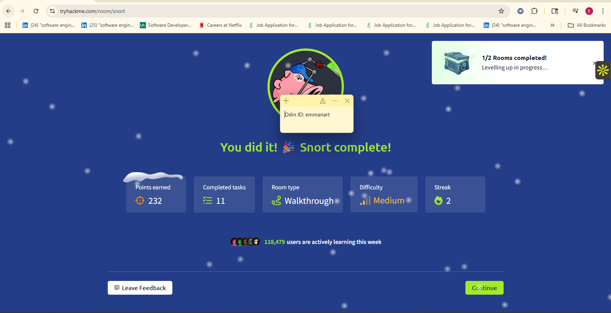

## Part 1 – Binary Bomb Progress

### Verifying the Bomb File
- Navigated to `introsec-f25-emmanart/hw5` and listed the contents to confirm the `bomb` executable was present.
- Ran `file bomb` to learn more about the binary. Output showed it is an ELF 32-bit LSB executable for Intel i386, dynamically linked, with debug information and symbols intact. This told me it should run on my Kali VM and will be easier to analyze in GDB because symbols were not stripped.

### Collecting Readable Strings
- Ran `strings bomb > strings_out_bomb.txt` and skimmed the output for clues.
- Found phase success messages, format strings like `%d %c %d`, `BOOM!!!` error text, and function names (`phase_1`…`phase_6`, `secret_phase`, `explode_bomb`).
- The file even mentions `bomb.c` (line 258), which makes it clear this is a compiled C program that I can run via `./bomb`.

### Running the Bomb Interactively
- Executed `./bomb` a few times to understand the user interaction:
  - Without correct input, the program immediately displays `BOOM!!! The bomb has blown up.` and exits.
  - After entering multiple lines, I observed the “Phase 1 defused” message once, which confirms the program accepts phase inputs sequentially and reports success before moving to the next phase.
  - Any incorrect or missing input after a phase success causes the bomb to explode.
- These runs confirmed that the bomb reads one line per phase, prints a success banner when correct, and terminates with BOOM on the first mistake. This gives me a baseline understanding before moving into GDB for deeper analysis.

### Full Disassembly Reference
- Ran `objdump -d bomb > objdump_bomb.asm` to dump the entire assembly and have a searchable reference.
- Used Ctrl+F for "phase" to jump to each phase function. In `phase_1` I saw two pushes right before `call strings_not_equal`: one pushes `%eax` (the user input pointer) and the other pushes the constant address `0x80497c0`.
- Noticed that `%eax` shows up throughout `main`, including right before each call to `phase_X`, which suggests the compiler uses `%eax` to pass the line the user just entered. That helped me reason that `0x80497c0` must point to the Phase 1 secret string.

### Phase 1 Solution
- Launched GDB with `gdb ./bomb` to inspect the binary at runtime.
- Used the examine command `x/s 0x80497c0` to print the string stored at the address identified in the disassembly:

```gdb
(gdb) x/s 0x80497c0
0x80497c0:      "Public speaking is very easy."
```

- GDB revealed the string: **"Public speaking is very easy."**
- Tested this input by running `./bomb` and entering the string, which successfully defused Phase 1:
  ```
  Welcome to my fiendish little bomb. You have 6 phases with
  which to blow yourself up. Have a nice day!
  Public speaking is very easy.
  Phase 1 defused. How about the next one?
  ```


### Phase 2 Solution
- Analyzed the `phase_2` function in the disassembly to understand what it expects.
- Phase 2 calls `read_six_numbers`, so it expects 6 integers as input.
- The first check (line 8048b63) requires the first number to be exactly `1`.
- Then there's a loop that validates each subsequent number using a specific formula.

**How the assembly builds the sequence:**

The loop (lines 8048b76-8048b8c) works like this: for each position `i` (starting from 1, going up to 5), it checks that:
- `array[i] = (i + 1) * array[i-1]`

Breaking it down step by step:
- Line 8048b76: `lea 0x1(%ebx),%eax` - This sets `%eax = %ebx + 1` (so if we're at position 1, `%eax = 2`)
- Line 8048b79: `imul -0x4(%esi,%ebx,4),%eax` - This multiplies `%eax` by the previous number in the array (the number at position `i-1`)
- Line 8048b7e: `cmp %eax,(%esi,%ebx,4)` - This checks if the current number equals the calculated value

So starting with the first number being 1:
- Number 1: `1` (required by the first check)
- Number 2: `(1+1) * 1 = 2`
- Number 3: `(2+1) * 2 = 6`
- Number 4: `(3+1) * 6 = 24`
- Number 5: `(4+1) * 24 = 120`
- Number 6: `(5+1) * 120 = 720`

- Tested the solution by running the bomb interactively:
  ```bash
  ./bomb
  ```
  
  Entered the solutions:
  - Phase 1: `Public speaking is very easy.`
  - Phase 2: `1 2 6 24 120 720`
  
  Successfully defused both phases:
  ```
  Welcome to my fiendish little bomb. You have 6 phases with
  which to blow yourself up. Have a nice day!
  Public speaking is very easy.
  Phase 1 defused. How about the next one?
  1 2 6 24 120 720
  That's number 2.  Keep going!
  ```

### Phase 3 Solution
- Analyzed the `phase_3` function in the disassembly to understand its structure.
- Examined the format string and jump table using GDB:

```gdb
(gdb) x/s 0x80497de
0x80497de:      "%d %c %d"

(gdb) x/8x 0x80497e8
0x80497e8:      0xe0    0x8b    0x04    0x08    0x00    0x8c    0x04    0x08
```

- Phase 3 uses `sscanf` with format string `"%d %c %d"` (found at address `0x80497de`), meaning it expects: number, character, number.
- The first number must be between 0-7 (checked at line 8048bc9: `cmpl $0x7,-0xc(%ebp)`).
- Phase 3 uses a jump table (starting at address `0x80497e8`) to select different cases based on the first number.

**How the jump table works:**

Each case (0-7) sets a specific character and checks a specific third integer value:
- **Case 0**: character `'q'` (0x71), third int = 777 (0x309)
- **Case 1**: character `'b'` (0x62), third int = 214 (0xd6)
- **Case 2**: character `'b'` (0x62), third int = 755 (0x2f3)
- **Case 3**: character `'k'` (0x6b), third int = 251 (0xfb)
- **Case 4**: character `'o'` (0x6f), third int = 160 (0xa0)
- **Case 5**: character `'t'` (0x74), third int = 458 (0x1ca)
- **Case 6**: character `'v'` (0x76), third int = 780 (0x30c)
- **Case 7**: character `'b'` (0x62), third int = 524 (0x20c)

The assembly code at line 8048bd6 uses an indirect jump: `jmp *0x80497e8(,%eax,4)` which jumps to the address stored in the jump table based on the first number. Each case then:
1. Sets a character value in `%bl` register
2. Checks if the third integer matches the expected value
3. At the end (line 8048c8f), compares the second input character with the character in `%bl`

- Tested Case 0 by running the bomb and entering:
  - Phase 1: `Public speaking is very easy.`
  - Phase 2: `1 2 6 24 120 720`
  - Phase 3: `0 q 777`
  
  Successfully defused Phase 3:
  ```
  Phase 1 defused. How about the next one?
  1 2 6 24 120 720
  That's number 2.  Keep going!
  0 q 777
  Halfway there!
  ```

### Phase 4 Solution
- Analyzed the `phase_4` function in the disassembly to understand its requirements.
- Examined the format string using GDB:

```gdb
(gdb) x/s 0x8049808
0x8049808:      "%d"
```

- Phase 4 uses `sscanf` with format string `"%d"` (found at address `0x8049808`), meaning it expects a single integer.
- The input integer must be greater than 0 (checked at line 8048d03: `cmpl $0x0,-0x4(%ebp)`).
- Phase 4 calls `func4` with the input integer and checks if it returns `0x37` (55 in decimal).

**Understanding func4 - a recursive Fibonacci-like function:**

The `func4` function (starting at address `0x8048ca0`) implements a recursive pattern:
- **Base cases:** `func4(0) = 1` and `func4(1) = 1` (line 8048cd0 returns 1 if input <= 1)
- **Recursive case:** For n > 1, `func4(n) = func4(n-1) + func4(n-2)`

This is similar to the Fibonacci sequence, but with different base values. Calculating the sequence:
- func4(0) = 1
- func4(1) = 1
- func4(2) = func4(1) + func4(0) = 1 + 1 = 2
- func4(3) = func4(2) + func4(1) = 2 + 1 = 3
- func4(4) = func4(3) + func4(2) = 3 + 2 = 5
- func4(5) = func4(4) + func4(3) = 5 + 3 = 8
- func4(6) = func4(5) + func4(4) = 8 + 5 = 13
- func4(7) = func4(6) + func4(5) = 13 + 8 = 21
- func4(8) = func4(7) + func4(6) = 21 + 13 = 34
- func4(9) = func4(8) + func4(7) = 34 + 21 = 55

Since Phase 4 requires `func4` to return 55, the input must be **9**.

- Tested the solution by running the bomb and entering:
  - Phase 1: `Public speaking is very easy.`
  - Phase 2: `1 2 6 24 120 720`
  - Phase 3: `0 q 777`
  - Phase 4: `9`
  
  Successfully defused Phase 4:
  ```
  Phase 1 defused. How about the next one?
  1 2 6 24 120 720
  That's number 2.  Keep going!
  0 q 777
  Halfway there!
  9
  So you got that one.  Try this one.
  ```

### Phase 5 Solution
- Analyzed the `phase_5` function in the disassembly to understand its transformation logic.
- Phase 5 expects a 6-character string (checked at line 8048d43: `cmp $0x6,%eax`).
- The phase uses a lookup table transformation:
  1. For each character in the input, takes only the lower 4 bits (0-15) using `and $0xf,%al`
  2. Uses those 4 bits as an index into a lookup table at address `0x804b220`
  3. Builds a new string from the lookup table characters
  4. Compares the transformed string with a target string at address `0x804980b`

**Finding the lookup table and target string:**

Examined both addresses using GDB:

```gdb
(gdb) x/s 0x804b220
0x804b220:      "isrveawhobpnutfg\260\001"

(gdb) x/s 0x804980b
0x804980b:      "giants"
```

- Lookup table (at `0x804b220`): `"isrveawhobpnutfg"` (16 characters for indices 0-15)
- Target string (at `0x804980b`): `"giants"`

**Working backwards to find the input:**

To produce "giants", we need to find which indices in the lookup table give us each character:
- 'g' is at position 15 in "isrveawhobpnutfg" (i=0, s=1, r=2, v=3, e=4, a=5, w=6, h=7, o=8, b=9, p=10, n=11, u=12, t=13, f=14, g=15)
- 'i' is at position 0
- 'a' is at position 5
- 'n' is at position 11
- 't' is at position 13
- 's' is at position 1

So we need input characters whose lower 4 bits are: **15, 0, 5, 11, 13, 1**

**Finding characters with those lower 4 bits:**
- 15 (0x0F): 'o' (0x6F), 'O' (0x4F), '?' (0x3F)
- 0 (0x00): '@' (0x40), 'P' (0x50), '`' (0x60)
- 5 (0x05): 'e' (0x65), 'E' (0x45), 'u' (0x75)
- 11 (0x0B): 'k' (0x6B), 'K' (0x4B), '{' (0x7B)
- 13 (0x0D): 'm' (0x6D), 'M' (0x4D), '}' (0x7D)
- 1 (0x01): 'a' (0x61), 'A' (0x41), 'q' (0x71)

One solution: **"opekma"**
- 'o' (0x6F & 0x0F = 15) maps to lookup[15] = 'g' 
- 'p' (0x70 & 0x0F = 0) maps to lookup[0] = 'i' 
- 'e' (0x65 & 0x0F = 5) maps to lookup[5] = 'a' 
- 'k' (0x6B & 0x0F = 11) maps to lookup[11] = 'n' 
- 'm' (0x6D & 0x0F = 13) maps to lookup[13] = 't' 
- 'a' (0x61 & 0x0F = 1) maps to lookup[1] = 's' 

- Tested the solution by running the bomb and entering:
  - Phase 1: `Public speaking is very easy.`
  - Phase 2: `1 2 6 24 120 720`
  - Phase 3: `0 q 777`
  - Phase 4: `9`
  - Phase 5: `opekma`
  
  Successfully defused Phase 5:
  ```
  Phase 1 defused. How about the next one?
  1 2 6 24 120 720
  That's number 2.  Keep going!
  0 q 777
  Halfway there!
  9
  So you got that one.  Try this one.
  opekma
  Good work!  On to the next...
  ```

### Phase 6 Solution
- Analyzed the `phase_6` function in the disassembly to understand its linked list manipulation.
- Phase 6 calls `read_six_numbers`, so it expects 6 integers as input.
- The input numbers must be 1-6 and all unique (validated in the first loop).
- Phase 6 uses a linked list structure starting at address `0x804b26c`.

**Understanding the linked list structure:**

Each node in the linked list is 12 bytes:
- Bytes 0-3: Value (4 bytes, little-endian format)
- Bytes 4-7: Index/ID (4 bytes)
- Bytes 8-11: Next pointer (4 bytes, little-endian format)

**Extracting node values from hex dumps:**

To read the value from a hex dump like:
```
0x804b26c <node1>: 0xfd 0x00 0x00 0x00
```
The first 4 bytes in little-endian format represent the value: `0x000000fd` = 253 in decimal.

**Finding all 6 nodes:**

Traced through the linked list using GDB to find all node values. Started by examining the initial memory dump:

```gdb
(gdb) x/20x 0x804b26c
0x804b26c <node1>:      0xfd    0x00    0x00    0x00    0x01    0x00    0x00    0x00
0x804b274 <node1+8>:    0x60    0xb2    0x04    0x08    0xe9    0x03    0x00    0x00
0x804b27c <n48+4>:      0x00    0x00    0x00    0x00    0x00    0x00    0x00    0x00
```

Then examined each node individually to extract their values and next pointers:

```gdb
(gdb) x/12x 0x804b26c
0x804b26c <node1>:      0xfd    0x00    0x00    0x00    0x01    0x00    0x00    0x00
0x804b274 <node1+8>:    0x60    0xb2    0x04    0x08

(gdb) x/12x 0x0804b260
0x804b260 <node2>:      0xd5    0x02    0x00    0x00    0x02    0x00    0x00    0x00
0x804b268 <node2+8>:    0x54    0xb2    0x04    0x08

(gdb) x/12x 0x0804b254
0x804b254 <node3>:      0x2d    0x01    0x00    0x00    0x03    0x00    0x00    0x00
0x804b25c <node3+8>:    0x48    0xb2    0x04    0x08

(gdb) x/12x 0x0804b248
0x804b248 <node4>:      0xe5    0x03    0x00    0x00    0x04    0x00    0x00    0x00
0x804b250 <node4+8>:    0x3c    0xb2    0x04    0x08

(gdb) x/12x 0x0804b23c
0x804b23c <node5>:      0xd4    0x00    0x00    0x00    0x05    0x00    0x00    0x00
0x804b244 <node5+8>:    0x30    0xb2    0x04    0x08

(gdb) x/12x 0x0804b230
0x804b230 <node6>:      0xb0    0x01    0x00    0x00    0x06    0x00    0x00    0x00
0x804b238 <node6+8>:    0x00    0x00    0x00    0x00
```

Extracted node values from the hex dumps:
- **node1** (at `0x804b26c`): value = 253 (0x000000fd), next = 0x0804b260
- **node2** (at `0x804b260`): value = 725 (0x000002d5), next = 0x0804b254
- **node3** (at `0x804b254`): value = 301 (0x0000012d), next = 0x0804b248
- **node4** (at `0x804b248`): value = 997 (0x000003e5), next = 0x0804b23c
- **node5** (at `0x804b23c`): value = 212 (0x000000d4), next = 0x0804b230
- **node6** (at `0x804b230`): value = 432 (0x000001b0), next = 0x00000000 (null, end of list)

**Determining the correct input order:**

Phase 6 reorders the linked list based on the input sequence and then checks if the reordered list has values in descending order. To produce a descending list, we need to sort the nodes by value:

- node4: 997 (highest)
- node2: 725
- node6: 432
- node3: 301
- node1: 253
- node5: 212 (lowest)

Therefore, the input sequence should be: **4 2 6 3 1 5**

- Tested the solution by running the bomb and entering:
  - Phase 1: `Public speaking is very easy.`
  - Phase 2: `1 2 6 24 120 720`
  - Phase 3: `0 q 777`
  - Phase 4: `9`
  - Phase 5: `opekma`
  - Phase 6: `4 2 6 3 1 5`
  
  Successfully defused all phases:
  ```
  Phase 1 defused. How about the next one?
  1 2 6 24 120 720
  That's number 2.  Keep going!
  0 q 777
  Halfway there!
  9
  So you got that one.  Try this one.
  opekma
  Good work!  On to the next...
  4 2 6 3 1 5
  Congratulations! You've defused the bomb!
  ```

## Part 2 – Snort TryHackMe

- Completed the Snort TryHackMe room.




## Part 3 – Static Application Security Testing (SAST)

### Installing Semgrep
- Installed Semgrep, a popular SAST tool, using pip3 on my VM.
- Verified the installation by checking the version:

```sh
❯ semgrep --version
1.144.0
```

- Semgrep is now ready to use for analyzing the cloud-arthur-emmanart project for security vulnerabilities.

### Running Semgrep Scan
- Navigated to the `cloud-arthur-emmanart` project directory.
- Ran Semgrep with automatic rule configuration to scan the entire project:

```sh
semgrep --config=auto .
```

- The scan analyzed 70 git-tracked files and ran 311 security rules.
- **Results: Found 8 security findings** across the project:

#### Security Issues Found:

1. **Flask App Security Issues (4 findings):**
   - `hw2/app.py` and `hw4/app.py`: Both Flask applications are configured with `host='0.0.0.0'` and `debug=True`
     - Running with `host='0.0.0.0'` exposes the server publicly, which could be a security risk
     - `debug=True` should never be enabled in production as it can leak sensitive information

2. **Missing CSRF Protection (2 findings):**
   - `hw2/templates/sign.html` and `hw4/templates/sign.html`: Forms are missing CSRF tokens
     - Without CSRF tokens, the forms are vulnerable to Cross-Site Request Forgery attacks

3. **Dockerfile Security Issues (2 findings):**
   - `hw4/Dockerfile`: Container is running as root user
     - Running containers as root is a security hazard; if an attacker gains control, they have root privileges
     - Should specify a non-root USER in the Dockerfile

These findings demonstrate how SAST tools can automatically identify security vulnerabilities and misconfigurations in source code before deployment.

## Part 4 – Dynamic Application Security Testing (DAST)

### Checking GVM Installation
- Checked if GVM (Greenbone Vulnerability Manager) is installed on my VM:

```sh
❯ which gvm-setup
/usr/bin/gvm-setup
```

- GVM is already installed and available at `/usr/bin/gvm-setup`.

### Starting the Application for DAST Scanning
- Navigated to the `cloud-arthur-emmanart/hw2` directory to start the Flask application.
- Started the Flask app so it's running and accessible for GVM to scan:

```sh
❯ python3 app.py
 * Serving Flask app 'app'
 * Debug mode: on
WARNING: This is a development server. Do not use it in a production deployment. Use a production WSGI server instead.
 * Running on all addresses (0.0.0.0)
 * Running on http://127.0.0.1:5000
 * Running on http://172.23.91.31:5000
Press CTRL+C to quit
 * Restarting with stat
 * Debugger is active!
 * Debugger PIN: 691-103-157
```

- The application is now running and accessible on port 5000, ready for dynamic security scanning.

### Running Flask App in Background
- To allow running other commands while the Flask app continues running, started it in the background:
  - Initially attempted to run with `python3 app.py &`, but the process was suspended due to terminal output
  - Killed the suspended process and restarted with output redirected to a log file:
    ```bash
    python3 app.py > flask_output.log 2>&1 &
    ```
- Verified the Flask app is running and listening on port 5000:

```sh
❯ ps aux | grep app.py | grep -v grep
emmarth+   11736  0.3  0.1  44956 36276 pts/2    TN   12:31   0:00 /home/emmarthur/.pyenv/versions/3.12.6/bin/python3 app.py
emmarth+   11813  0.3  0.1  44916 35892 pts/2    TN   12:31   0:00 /home/emmarthur/.pyenv/versions/3.12.6/bin/python3 app.py

❯ netstat -tlnp | grep 5000
(Not all processes could be identified, non-owned process info
 will not be shown, you would have to be root to see it all.)
tcp        0      0 0.0.0.0:5000            0.0.0.0:*               LISTEN      11736/python3
```

- Confirmed the Flask application is running in the background (process 11736) and listening on port 5000, ready for GVM scanning.

### Checking GVM Services Status
- Checked the status of GVM services to see if they're running:

```sh
❯ sudo systemctl status gvmd
○ gvmd.service - Greenbone Vulnerability Manager daemon (gvmd)
     Loaded: loaded (/usr/lib/systemd/system/gvmd.service; disabled; preset: disabled)
     Active: inactive (dead)
       Docs: man:gvmd(8)

❯ sudo systemctl status gsad
○ gsad.service - Greenbone Security Assistant daemon (gsad)
     Loaded: loaded (/usr/lib/systemd/system/gsad.service; disabled; preset: disabled)
     Active: inactive (dead)
       Docs: man:gsad(8)
             https://www.greenbone.net
```

- Both GVM services (gvmd and gsad) are currently inactive and need to be started.

### Running GVM Initial Setup
- Attempted to start gvmd service but encountered timeout errors. The service was failing because GVM had not been initialized.
- Ran `gvm-setup` to initialize GVM database and configuration:

```sh
❯ sudo gvm-setup
[>] Starting PostgreSQL service
[>] Creating GVM's certificate files
[>] Creating PostgreSQL database
[*] Creating database user
[*] Creating database
[*] Creating permissions
[*] Applying permissions
[*] Creating extension uuid-ossp
[*] Creating extension pgcrypto
[*] Creating extension pg-gvm
[>] Migrating database
[>] Checking for GVM admin user
[*] Creating user admin for gvm
[*] User created with password 'dc6a7aa5-38d7-4d17-94d8-016029036f0e'.
[*] Configure Feed Import Owner
[*] Update GVM feeds
[+] Done
```

- GVM setup completed successfully. The admin user was created with password `dc6a7aa5-38d7-4d17-94d8-016029036f0e`. The vulnerability feeds were downloaded (with a minor rsync error that didn't prevent completion).

### Starting GVM Services
- After setup completion, started the GVM services:

```sh
❯ sudo systemctl start gvmd
❯ sudo systemctl status gvmd
● gvmd.service - Greenbone Vulnerability Manager daemon (gvmd)
     Loaded: loaded (/usr/lib/systemd/system/gvmd.service; disabled; preset: disabled)
     Active: active (running) since Sun 2025-11-30 12:42:01 PST; 16min ago
   Main PID: 14337 (gvmd)
      Tasks: 5 (limit: 38318)
     Memory: 158.1M

❯ sudo systemctl start gsad
❯ sudo systemctl status gsad
● gsad.service - Greenbone Security Assistant daemon (gsad)
     Loaded: loaded (/usr/lib/systemd/system/gsad.service; disabled; preset: disabled)
     Active: active (running) since Sun 2025-11-30 12:58:46 PST; 10s ago
   Main PID: 17603 (gsad)
      Tasks: 4 (limit: 38318)
     Memory: 5.1M
```

- Both GVM services (gvmd and gsad) are now running successfully. The gsad service is listening on port 9392, providing the web interface for GVM.

### Configuring GVM Web Interface Access
- Initially, gsad was only listening on `127.0.0.1` (localhost), making it inaccessible from the host machine.
- Created a systemd override to configure gsad to listen on all interfaces (`0.0.0.0`):

```sh
❯ sudo mkdir -p /etc/systemd/system/gsad.service.d
❯ echo -e '[Service]\nExecStart=\nExecStart=/usr/sbin/gsad --foreground --listen 0.0.0.0 --port 9392' | sudo tee /etc/systemd/system/gsad.service.d/override.conf
❯ sudo systemctl daemon-reload
❯ sudo systemctl start gsad
❯ sudo systemctl status gsad
● gsad.service - Greenbone Security Assistant daemon (gsad)
     Active: active (running)
   Main PID: 19751 (gsad)
             ├─19751 /usr/sbin/gsad --foreground --listen 0.0.0.0 --port 9392

❯ netstat -tlnp | grep 9392
tcp        0      0 0.0.0.0:9392            0.0.0.0:*               LISTEN      -
```

- gsad is now listening on all interfaces (0.0.0.0:9392), making it accessible from the host machine at `http://172.23.91.31:9392`.

### Using GVM Command Line Interface
- Changed the admin password to simplify authentication:
  ```bash
  sudo -u _gvm gvmd --user=admin --new-password=admin123
  ```
- Authenticated with GVM using gvm-cli:
  ```bash
  gvm-cli socket -X '<get_version/>'
  ```
  Successfully authenticated and confirmed GVM version 22.7.

### Creating Target and Port List
- Created a port list for port 5000 (where the Flask app is running):
  ```bash
  gvm-cli socket -X '<create_port_list><name>Flask Port 5000</name><port_range>5000</port_range></create_port_list>'
  ```
  Port list created with ID: `d11811eb-7dc7-400a-a192-2a410fed8698`

- Created a target pointing to the Flask application:
  ```bash
  gvm-cli socket -X '<create_target><name>Flask App</name><hosts>127.0.0.1</hosts><port_list id="d11811eb-7dc7-400a-a192-2a410fed8698"/></create_target>'
  ```
  Target created with ID: `76dc6598-945c-4123-b414-0a06990d38db`

- Verified available scanners:
  ```bash
  gvm-cli socket -X '<get_scanners/>'
  ```
  Found two scanners: "CVE" and "OpenVAS Default" (ID: `08b69003-5fc2-4037-a479-93b440211c73`)

### Feed Synchronization and Scan Configuration
- Initially, scan configs were not available due to feed synchronization still in progress.
- After feed synchronization completed, verified scan configs were available:
  ```bash
  gvm-cli socket -X '<get_configs/>'
  ```
  Multiple scan configurations were available, including:
  - "Base" (ID: `d21f6c81-2b88-4ac1-b7b4-a2a9f2ad4663`) - Basic configuration with minimum set of NVTs
  - "Discovery" - Network Discovery scan configuration
  - "Full and fast" - Comprehensive scan with 137,196 NVTs
  - "Host Discovery" - Network Host Discovery scan configuration

### Creating and Running the Scan
- Created a scan task targeting the Flask application:
  ```bash
  gvm-cli socket -X '<create_task><name>Flask App Scan</name><target id="76dc6598-945c-4123-b414-0a06990d38db"/><scanner id="08b69003-5fc2-4037-a479-93b440211c73"/><config id="d21f6c81-2b88-4ac1-b7b4-a2a9f2ad4663"/></create_task>'
  ```
  
  **XML Response:**
  ```xml
  <create_task_response status="201" status_text="OK, resource created" id="9d0f8022-56fa-4028-b2c4-3d5343ef94d0"/>
  ```
  
  Task created with ID: `9d0f8022-56fa-4028-b2c4-3d5343ef94d0`

- Started the scan:
  ```bash
  gvm-cli socket -X '<start_task task_id="9d0f8022-56fa-4028-b2c4-3d5343ef94d0"/>'
  ```
  
  **XML Response:**
  ```xml
  <start_task_response status="202" status_text="OK, request submitted"><report_id>a29b7da1-49bb-40a6-9cb5-355ce79cb850</report_id></start_task_response>
  ```
  
  Scan started and report created with ID: `a29b7da1-49bb-40a6-9cb5-355ce79cb850`

### Scan Results
- Checked scan status:
  ```bash
  gvm-cli socket -X '<get_tasks task_id="9d0f8022-56fa-4028-b2c4-3d5343ef94d0"/>'
  ```
  
  **XML Response (excerpt showing key fields):**
  ```xml
  <get_tasks_response status="200" status_text="OK">
    <task id="9d0f8022-56fa-4028-b2c4-3d5343ef94d0">
      <name>Flask App Scan</name>
      <status>Done</status>
      <last_report>
        <report id="a29b7da1-49bb-40a6-9cb5-355ce79cb850">
          <scan_start>2025-12-07T18:03:55Z</scan_start>
          <scan_end>2025-12-07T18:04:05Z</scan_end>
          <result_count>
            <hole deprecated='1'>0</hole>
            <high>0</high>
            <info deprecated='1'>0</info>
            <low>0</low>
            <log>1</log>
            <warning deprecated='1'>0</warning>
            <medium>0</medium>
            <false_positive>0</false_positive>
          </result_count>
          <severity>0.0</severity>
        </report>
      </last_report>
    </task>
  </get_tasks_response>
  ```

- Retrieved detailed scan results:
  ```bash
  gvm-cli socket -X '<get_results report_id="a29b7da1-49bb-40a6-9cb5-355ce79cb850"/>'
  ```
  
  **XML Response (excerpt showing the log entry):**
  ```xml
  <get_results_response status="200" status_text="OK">
    <result id="f58b080a-0969-4ff3-b4e4-0799e3aad1ac">
      <name>Hostname Determination Reporting</name>
      <host>127.0.0.1<hostname>localhost</hostname></host>
      <port>general/tcp</port>
      <nvt oid="1.3.6.1.4.1.25623.1.0.108449">
        <name>Hostname Determination Reporting</name>
        <family>Service detection</family>
        <cvss_base>0.0</cvss_base>
      </nvt>
      <threat>Log</threat>
      <severity>0.0</severity>
      <description>Hostname determination for IP 127.0.0.1:

  Hostname|Source
  localhost|Reverse-DNS
  </description>
    </result>
  </get_results_response>
  ```

- Scan completed successfully in approximately 10 seconds.
- **Scan Summary:**
  - **Status:** Done
  - **Duration:** ~10 seconds (from 18:03:55 to 18:04:05)
  - **Vulnerabilities Found:**
    - High: 0
    - Medium: 0
    - Low: 0
    - Log entries: 1
  - **Overall Severity:** 0.0

- **Detailed Results:**
  - One log entry was found: "Hostname Determination Reporting"
    - **Description:** Informational log showing that IP 127.0.0.1 resolves to hostname "localhost" via reverse DNS
    - **Threat Level:** Log (informational only, not a vulnerability)
    - **Severity:** 0.0

- **Analysis:**
  The scan using the "Base" configuration did not find any security vulnerabilities in the Flask application. The only result was an informational log entry about hostname resolution, which is expected for localhost scans. This indicates that the Flask application did not exhibit obvious security vulnerabilities detectable by the Base scan configuration.

- **Limitations and Observations:**
  - The scan results show `port>general/tcp</port>` rather than a specific port 5000 finding, which suggests the "Base" scan configuration may have performed minimal testing.
  - The "Base" configuration is described as having "a minimum set of NVTs" and may not include comprehensive web application scanning.
  - To get more thorough results for a Flask web application, a more comprehensive scan configuration like "Full and fast" or a web application-specific scan would be recommended.
  - The scan did successfully target 127.0.0.1 (the Flask app's host), but the minimal results suggest either:
    1. The Flask application was not actively serving requests during the scan, or
    2. The "Base" scan configuration focuses on basic network discovery rather than deep application testing

This demonstrates the complete process of using GVM (Greenbone Vulnerability Manager) for dynamic application security testing, from installation and configuration through scan execution and results analysis.